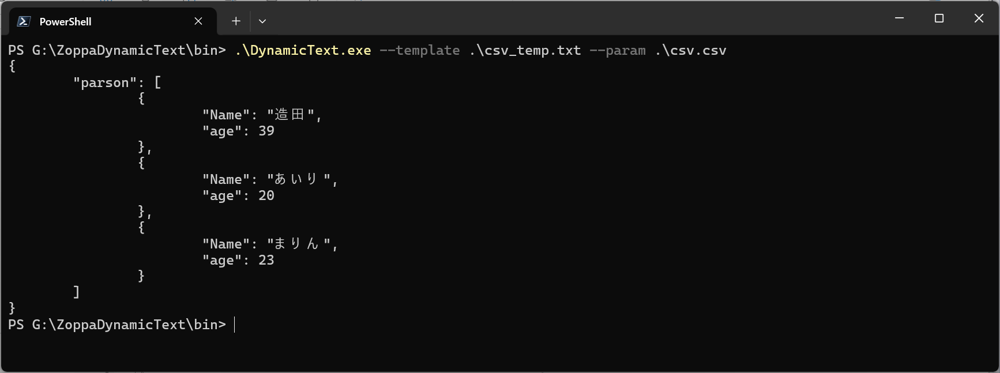

# DynamicText
文章に埋込式を設定して、動的に文章を作成します。  
  
## 特徴
UTF-8で記述したテンプレートファイルに値を展開して、動的にドキュメントを作成します。  
  
## 依存関係
* ZoppaDynamicText.dll  
  埋込式の解析を行うライブラリです。  
  
## 使い方
テンプレートファイルとパラメータファイルを作成します、UTF-8エンコードで保存してください。  
テンプレートファイルで文章の構造と埋込式で動的な要素を記述します。  
パラメータファイルで要素の値を記述します。  
コマンドを実行すると埋込式に値を展開したドキュメントを作成します。  
  
#### テンプレートファイル 
```
# #{app_title}
#{app_summary}  
  
## 特徴
  
## 依存関係
  
## 使い方
  
## インストール
  
## 作成情報
* #{author}
* #{affiliation}
* #{mail}
  
## ライセンス
#{license}
```
#### パラメータファイル
```
app_title = "DynamicText";
app_summary = "文章に埋込式を設定して、動的に文章を作成します。";
author = "造田 崇";
affiliation = "ミウラ 第一システムカンパニー";
mail = "takashi.zouta@kkmiura.co.jp";
license = "apache 2.0";
```
#### 実行
```
> .\DynamicText.exe --template .\READ_ME_template.txt --param .\READ_ME_param.txt
```
#### 実行結果
```
# DynamicText
文章に埋込式を設定して、動的に文章を作成します。

## 特徴

## 依存関係

## 使い方

## インストール

## 作成情報
* 造田 崇
* ミウラ 第一システムカンパニー
* takashi.zouta@kkmiura.co.jp

## ライセンス
apache 2.0
```

  
### CSVファイルを使用
パラメータファイルに`CSV`ファイルを与えることで、パラメータに 1レコード単位の配列データを与えることができます。  
テンプレートファイルから参照する場合は`ファイル名`で配列を参照し、`列名`がプロパティ名になります。  
  
#### テンプレートファイル 
```
\{
	"parson": [
		{trim ','}{for r in csv}\{
			"Name": "#{r.Name}",
			"age": #{r.age}
		\},
		{/for}{/trim}
	]
\}
```
#### パラメータファイル
```
Name, age
造田, 39
あいり, 20
まりん, 23
```
#### 実行
```
> .\DynamicText.exe --template .\csv_temp.txt --param .\csv.csv
```
#### 実行結果
```
{
	"parson": [
		{
			"Name": "造田",
			"age": 39
		},
		{
			"Name": "あいり",
			"age": 20
		},
		{
			"Name": "まりん",
			"age": 23
		}
	]
}
```

  
## インストール
ビルドした実行ファイルを適当なパスに配置してください。  
  
## 作成情報
* 造田 崇
* ミウラ 第一システムカンパニー
* takashi.zouta@kkmiura.co.jp
  
## ライセンス
[apache 2.0](https://github.com/zoppa-software/ZoppaDynamicText?tab=Apache-2.0-1-ov-file)
